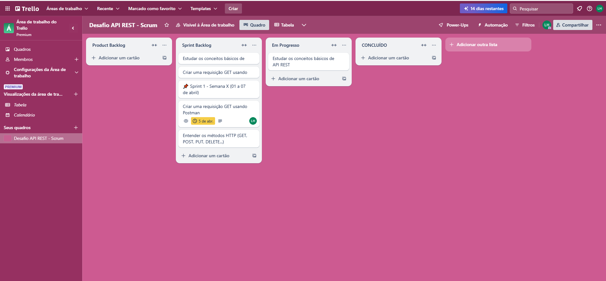

# API JSONPlaceholder com Flask e Requests

Este é um projeto simples de estudo em que consumimos a API pública [JSONPlaceholder](https://jsonplaceholder.typicode.com/posts) utilizando Python, Flask e a biblioteca Requests.

## 🚀 Tecnologias Utilizadas

- Python 3.11+
- Flask
- Requests

## 📁 Estrutura de Pastas

api-jsonplaceholder/ │ ├── app.py # Arquivo principal da aplicação Flask ├── requirements.txt # Dependências do projeto └── services/ └── jsonplaceholder.py # Módulo que consome a API externa


## 🔍 Funcionalidades

- Fazer uma requisição GET para a rota `/posts`
- Listar os posts da API externa no formato JSON
- Tratar e exibir o `status_code` da resposta

## ▶️ Como Rodar

1. Clone o repositório:
```bash
git clone https://github.com/leohegeto/api-jsonplaceholder.git
cd api-jsonplaceholder

Crie e ative um ambiente virtual:
python -m venv venv
.\venv\Scripts\activate  # Para Windows
 
Instale as dependências:
pip install -r requirements.txt

Rode a aplicação:
python app.py

Acesse no navegador:
http://127.0.0.1:5000/posts

🎯 Objetivos de Estudo
Praticar o uso do Flask

Consumir APIs REST com requests

Entender códigos de status HTTP

Organizar o projeto com boas práticas

👨‍💻 Feito com 💻 por @leohegeto! 

## 🧩 Planejamento no Trello



